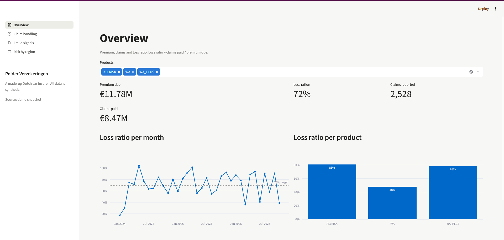
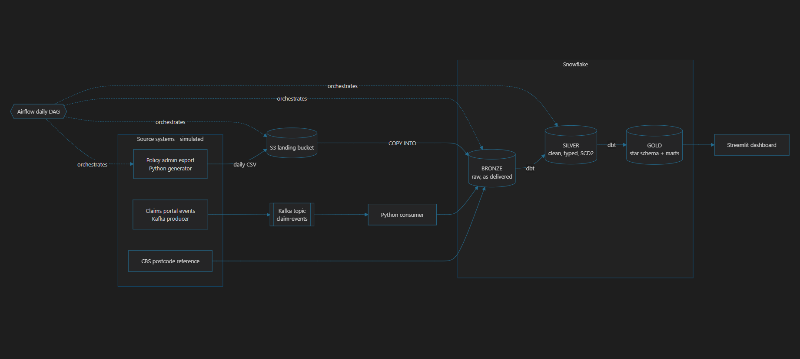
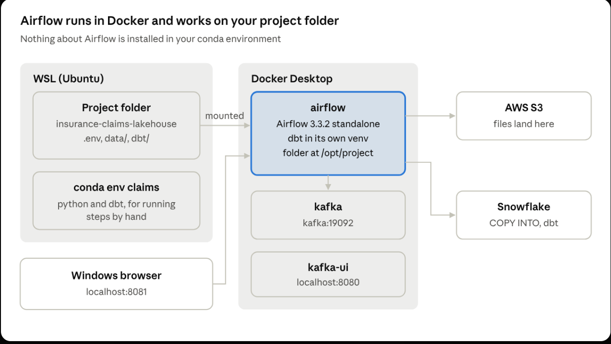

# Insurance Claims Lakehouse


A data platform for **Polder Verzekeringen**, a made-up Dutch car insurer.
Daily policy extracts and real-time claim events land in Snowflake, dbt
models them into Bronze / Silver / Gold layers, and a Streamlit dashboard
answers the questions management actually asks: are we making money on
each product, how fast do we pay claims, and which claims look suspicious?

**Live demo:** https://polder-insurance.streamlit.app



Stack: Python · Kafka · AWS S3 · Snowflake · dbt · Airflow · Streamlit · GitHub Actions

## Architecture



- **Batch path:** a Python generator plays the policy admin system and
  writes daily CSV extracts. They go to S3 and are loaded into Bronze with
  `COPY INTO` through a storage integration (IAM role, no access keys).
- **Streaming path:** claim events (reported, assessed, approved/rejected,
  paid) go through a Kafka topic. A consumer batches them into JSON files
  in S3, which land in a `VARIANT` column in Bronze.
- **Modelling:** dbt builds Silver (typed, cleaned, deduplicated, SCD2
  snapshots of customers and policies) and Gold (a small star schema plus
  four marts).
- **Orchestration:** one Airflow DAG runs the whole day, from generating
  the data to refreshing the dashboard's snapshot.

  

More detail and the layer rules are in [docs/architecture.md](docs/architecture.md).

## What's in Gold

| Table                                   | Grain                                     | Used for                                       |
| --------------------------------------- | ----------------------------------------- | ---------------------------------------------- |
| `fct_claims`                            | one claim                                 | everything about claims                        |
| `fct_premiums`                          | one monthly instalment                    | premium income                                 |
| `dim_customer`, `dim_policy`            | one version of a customer / policy (SCD2) | history, e.g. premium before and after renewal |
| `dim_vehicle`, `dim_region`, `dim_date` | one car / postcode / day                  | slicing                                        |
| `mart_loss_ratio_monthly`               | month × product                           | loss ratio trend                               |
| `mart_claims_sla`                       | month × claim type                        | handling speed                                 |
| `mart_fraud_signals`                    | one flagged claim                         | review list                                    |
| `mart_region_risk`                      | municipality                              | claims per 1,000 policies                      |

## Things I ran into

- **Messy source data, on purpose.** The generator exports the kind of mess
  a real policy system produces: postcodes like `3821ab`, emails in capitals,
  phone numbers written as `+31 6 ...` or `06...`, and the same customer sent
  twice. I kept Bronze exactly as it arrives (all `VARCHAR`, plus the source
  file and load time) and did the cleaning in the dbt Silver models:
  `row_number()` keeps the latest version of each record, `try_to_date`
  turns bad dates into NULL instead of failing the load, and a few
  `regexp_replace` rules bring postcodes and phone numbers into one format.
  The rules live in `dbt/models/silver/`, and dbt tests (`unique`,
  `not_null`, `relationships`, `accepted_values` and one custom test)
  check the result on every build.
- **A wrong file format looked like a data problem.** On the first load the
  `not_null` test on postcode failed for every customer. The data was fine;
  the Snowflake file format split on commas while the extracts use
  semicolons, so every column after the first was shifted. Fixing
  `FF_CSV_SEMICOLON` and reloading solved it, and it is the reason I trust
  tests on Silver more than eyeballing a few rows.
- **Kafka delivers at least once.** If the consumer crashes after writing a
  batch to S3 but before committing its offset, the same events arrive
  again. Instead of trying to make the consumer perfect, I made the model
  idempotent: `stg_claim_events` is an incremental dbt model that only reads
  new Bronze rows and keeps the first copy of each `event_id`
  (`qualify row_number() ... = 1`).
- **SCD2 history only starts when the snapshots start.** The backfill is a
  picture of one day, so `dim_customer` and `dim_policy` begin with a single
  version per record. dbt snapshots (timestamp strategy on `updated_at`)
  add a new version for every house move or renewal from then on. One
  detail cost me an evening: the snapshot compares timestamps, so
  `updated_at` has to be cast to `timestamp_ntz` in Silver, not left as a
  date.
- **Two calendars that disagreed.** My first Airflow DAG passed Airflow's
  run date to the generator, but the generator keeps its own calendar and
  refuses to skip a day. After a few days made by hand, the two were out of
  step and the DAG failed on its first task. Now every task reads the last
  business day from the generator's state file, so one DAG run simply means
  "one more day", whenever it runs. `catchup` is off and
  `max_active_runs=1`, so two runs never touch the state at the same time.
- **The fraud rules found what I hid.** The generator plants a small set of
  large claims shortly after a policy starts. Four plain SQL rules in
  `mart_fraud_signals` (early claim, late report, claim close to the car's
  value, three or more claims in a year) flag almost all of them, among 210
  flagged claims in total. It is a review list, not a verdict, and the
  dashboard shows how many of those claims are still open and can be
  stopped.
- **The demo outlives the Snowflake trial.** The dashboard reads Gold live
  from Snowflake when credentials are in `.env`. Without them it falls back
  to a small Parquet export in `dashboard/demo_data/`, which Airflow
  refreshes after every run. The public app runs in that mode, so no
  password ever leaves my laptop.

## Run it yourself

You need Python 3.11, Docker Desktop, a Snowflake trial and an AWS account.

```bash
pip install -r requirements.txt
cp .env.example .env                         # fill in Snowflake + AWS

python scripts/build_postcode_reference.py   # once
python -m generator backfill                 # history up to 2026-09-30
pytest -q

# Snowflake: run snowflake/01, 02 and 03 in a worksheet (see comments inside)
python -m pipeline.s3_upload
python -m pipeline.bronze_load

cd dbt && dbt build --profiles-dir . && cd ..   # models, snapshots and tests

docker compose up -d                         # Kafka, Kafka UI (8080), Airflow (8081)
streamlit run dashboard/app.py
```

## Repository layout

| Path         | What                                                         |
| ------------ | ------------------------------------------------------------ |
| `generator/` | synthetic source systems (policies, premiums, claim events)  |
| `scripts/`   | one-off helpers (postcode reference from CBS)                |
| `pipeline/`  | S3 upload, Bronze load, demo export                          |
| `streaming/` | Kafka producer and consumer                                  |
| `snowflake/` | setup SQL: warehouse, schemas, S3 integration, Bronze tables |
| `aws/`       | IAM policy and trust policy for the integration              |
| `dbt/`       | Silver and Gold models, snapshots, tests                     |
| `airflow/`   | DAG and the Airflow image                                    |
| `dashboard/` | Streamlit app and its demo data                              |
| `tests/`     | pytest for the generator and the consumer                    |

The postcode reference comes from my
[nl-housing-data-cleaning](https://github.com/alibaghdadi1368/nl-housing-data-cleaning)
project (CBS open data, CC-BY 4.0).

## Contact

Ali Baghdadi · [LinkedIn](https://linkedin.com/in/alibaghdadi) · alibaghdadi1368@gmail.com
