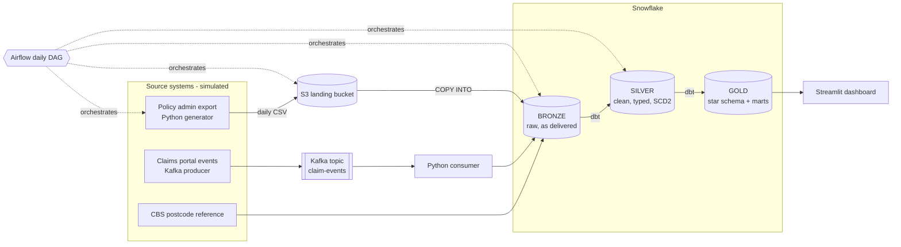

# Architecture

| Layer | What lives there | Rule |
|---|---|---|
| Bronze | Files and events exactly as received, plus load metadata | Never updated, only appended |
| Silver | Typed, deduplicated, standardised tables; policy history (SCD2) | One row per business entity version |
| Gold | Facts, dimensions and business marts | Only what the dashboard and analysts need |